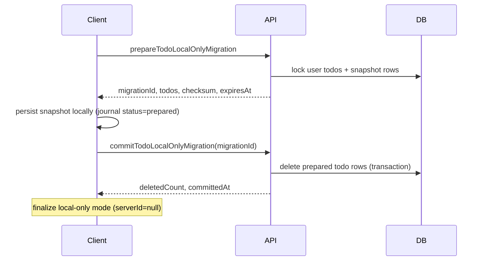

# Backend: Destructive Local-Only Todo Migration

This document specifies the backend work required to support the **destructive local-only** toggle used by the web and mobile clients.

When a user enables local-only mode, the client must:

1. Download an immutable snapshot of every server todo.
2. Persist that snapshot locally **before** requesting deletion.
3. Commit the migration so the backend permanently deletes the user's cloud todos.

Disabling local-only mode later uploads device todos as **new** server records (the backend starts empty).

---

## GraphQL contract

Add these types and mutations to the backend schema (already reflected in the frontend snapshot at `src/schema.gql`):

```graphql
type TodoLocalOnlyMigration {
  migrationId: ID!
  expiresAt: DateTime!
  todoCount: Int!
  checksum: String!
  todos: [Todo!]!
}

type TodoLocalOnlyMigrationCommit {
  migrationId: ID!
  deletedCount: Int!
  committedAt: DateTime!
}

extend type Mutation {
  prepareTodoLocalOnlyMigration: TodoLocalOnlyMigration!
  commitTodoLocalOnlyMigration(migrationId: ID!): TodoLocalOnlyMigrationCommit!
  cancelTodoLocalOnlyMigration(migrationId: ID!): MessagePayload!
}
```

All three mutations require an authenticated **ACTIVE** user. Scope every row to `auth.userId`.

---

## Checksum algorithm

The checksum proves the client received the exact snapshot the server prepared.

1. Take every todo in the prepared snapshot.
2. Sort by `id` ascending (lexicographic UUID order).
3. Build a pipe-delimited string: `id1:updatedAt1|id2:updatedAt2|...`
4. Return the lowercase hex SHA-256 digest of the UTF-8 payload.

Example (TypeScript):

```typescript
import { createHash } from "node:crypto";

export function computeMigrationChecksum(
  todos: Array<{ id: string; updatedAt: string }>,
) {
  const payload = [...todos]
    .sort((left, right) => left.id.localeCompare(right.id))
    .map(todo => `${todo.id}:${todo.updatedAt}`)
    .join("|");
  return createHash("sha256").update(payload).digest("hex");
}
```

The frontend uses the same algorithm via Web Crypto (`crypto.subtle.digest`).

---

## Two-phase execution model



### Phase 1 — `prepareTodoLocalOnlyMigration`

Responsibilities:

- Reject if the user already has an unexpired prepared migration (return `MIGRATION_ALREADY_PREPARED` or reuse the existing migration if your policy allows idempotent prepare).
- Reject if the user has **zero** todos (optional product decision; current clients allow empty migrations).
- Paginate internally if needed, but return **all** todos in one response (the client expects a full snapshot).
- Persist a migration record:

| Field | Purpose |
|-------|---------|
| `migrationId` | UUID primary key returned to the client |
| `userId` | Owner |
| `status` | `prepared` |
| `expiresAt` | e.g. now + 15 minutes |
| `todoIds` / serialized snapshot | Immutable list used for commit verification |
| `checksum` | SHA-256 as specified above |
| `todoCount` | Denormalized count |

- While status is `prepared`, **block todo mutations** for that user:
  - `createTodo`
  - `updateTodo`
  - `deleteTodo`

Suggested error:

```json
{
  "extensions": { "code": "MIGRATION_IN_PROGRESS" },
  "message": "Finish or cancel the local-only migration before changing todos."
}
```

Reads (`todos`, `todo`) may still work against the not-yet-deleted rows.

### Phase 2 — `commitTodoLocalOnlyMigration(migrationId)`

Responsibilities:

- Verify the migration belongs to the authenticated user.
- Verify status is `prepared` (or already `committed` for idempotent retries).
- In a **single transaction**:
  - Delete exactly the todo IDs captured in the prepared snapshot (not "all todos by updatedAt" heuristics).
  - Mark migration status `committed` with `committedAt`.
- Return `{ migrationId, deletedCount, committedAt }`.
- **Idempotency:** if the migration is already committed, return the same receipt without deleting again.

Commit must succeed even if some todo IDs were already removed (treat missing rows as already deleted), but `deletedCount` should reflect rows removed in the first successful commit.

### Cancel — `cancelTodoLocalOnlyMigration(migrationId)`

Use when the client fails **before** persisting the local journal (network error during prepare handling, checksum mismatch, etc.).

- Verify ownership.
- Allowed only while status is `prepared`.
- Release the migration lock and delete the migration record (or mark `cancelled`).
- Do **not** delete todos.
- Idempotent: cancelling an unknown/already-cancelled migration returns success.

---

## Suggested persistence

```sql
CREATE TABLE todo_local_only_migrations (
  id UUID PRIMARY KEY,
  user_id UUID NOT NULL REFERENCES users(id),
  status TEXT NOT NULL CHECK (status IN ('prepared', 'committed', 'cancelled')),
  checksum TEXT NOT NULL,
  todo_count INT NOT NULL,
  snapshot JSONB NOT NULL,
  expires_at TIMESTAMPTZ NOT NULL,
  committed_at TIMESTAMPTZ,
  created_at TIMESTAMPTZ NOT NULL DEFAULT now()
);

CREATE INDEX todo_local_only_migrations_user_status_idx
  ON todo_local_only_migrations (user_id, status);
```

Run a periodic job to cancel expired `prepared` migrations and release locks.

---

## Error codes

| Code | When |
|------|------|
| `MIGRATION_IN_PROGRESS` | Todo CRUD attempted while prepare is active |
| `MIGRATION_NOT_FOUND` | Unknown `migrationId` for this user |
| `MIGRATION_EXPIRED` | Commit attempted after `expiresAt` |
| `MIGRATION_ALREADY_COMMITTED` | Optional explicit code; otherwise return the original receipt |
| `UNAUTHENTICATED` | Missing/invalid session |
| `FORBIDDEN` | User not ACTIVE |

---

## Backend tests (minimum)

1. Prepare returns all todos, stable checksum, and blocks CRUD.
2. Commit deletes exactly the prepared snapshot and is idempotent on retry.
3. Cancel releases the lock without deleting todos.
4. Expired prepare cannot be committed.
5. User A cannot commit user B's migration.
6. Concurrent prepare requests for the same user are handled safely.

---

## Deployment notes

- Ship backend **before** or together with clients that call the new mutations.
- Old clients that only mirrored todos without deletion must be upgraded; document the breaking behavior change in release notes.
- Monitor `commitTodoLocalOnlyMigration` volume and failures — a failed commit after local persistence leaves cloud data intact until the client retries.

---

## Related frontend documents

- Web/mobile client handoff: [`MOBILE_LOCAL_ONLY_MIGRATION.md`](MOBILE_LOCAL_ONLY_MIGRATION.md)
- General offline behavior: [`README.md`](README.md) (Offline todo sync section)
