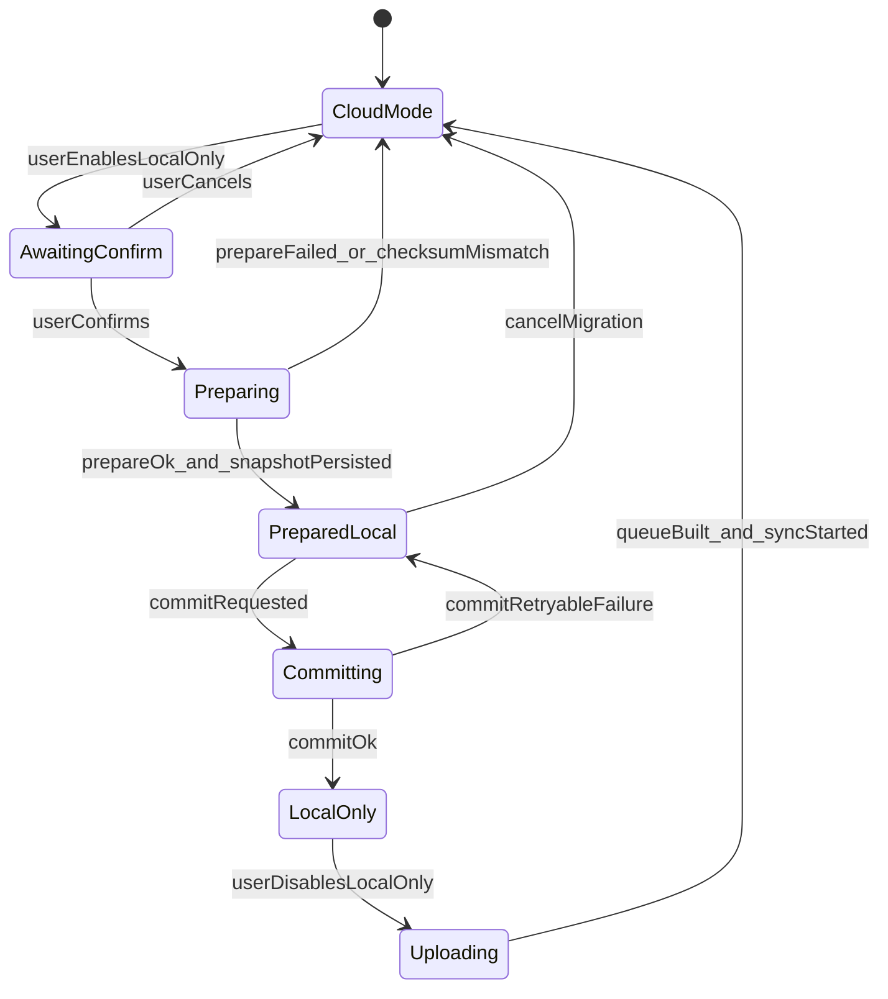

# Mobile: Destructive Local-Only Todo Migration

This guide describes how Expo/React Native clients should implement the **destructive local-only** toggle that matches the web app.

Backend contract details live in [`BACKEND_LOCAL_ONLY_MIGRATION.md`](BACKEND_LOCAL_ONLY_MIGRATION.md).

---

## Product behavior

When the user enables **Local-only todos**:

1. Show a **destructive confirmation** explaining:
   - All server todos will be downloaded to the device.
   - After download, the server copy is **permanently deleted**.
   - Todos exist only on the device until the user disables local-only and confirms upload.
2. Require network connectivity and no pending offline sync queue.
3. Run the two-phase backend migration (`prepare` → local persist → `commit`).
4. Switch all todo CRUD to device storage (`syncStatus: local_only`, no GraphQL).

When the user disables local-only:

1. Show a confirmation that local todos will be uploaded.
2. Because the backend is empty after migration, queue **CREATE** operations for every retained device todo.
3. Start background sync.

Profile edits remain server-only in all modes.

---

## State machine



---

## Persisted store shape

Use the same per-user key pattern as offline sync:

```
offline.todos.v2:{userId}
```

Minimum fields (align with web `UserOfflineStore` v2):

```typescript
interface UserOfflineStore {
  version: 2;
  userId: string;
  localOnly: boolean;
  baselineSnapshot: LocalTodoRecord[]; // empty [] after destructive migration
  todos: LocalTodoRecord[];
  queue: QueuedOperation[];
  lastSyncAt: string | null;
  migrationJournal: LocalOnlyMigrationJournal | null;
}

interface LocalOnlyMigrationJournal {
  migrationId: string;
  expiresAt: string;
  checksum: string;
  todoCount: number;
  preparedAt: string | null;
  committedAt: string | null;
  status: "prepared" | "committing";
  snapshot: LocalTodoRecord[];
}
```

Journal rules:

- Write journal with `status: "prepared"` **before** calling `commitTodoLocalOnlyMigration`.
- Set `status: "committing"` immediately before the commit mutation.
- Clear `migrationJournal` after successful finalize.
- On app launch, if journal status is `prepared` or `committing` and the device is online, retry commit (idempotent).

---

## GraphQL operations

```graphql
mutation PrepareTodoLocalOnlyMigration {
  prepareTodoLocalOnlyMigration {
    migrationId
    expiresAt
    todoCount
    checksum
    todos { id title description done dueTo reminderOn createdAt updatedAt }
  }
}

mutation CommitTodoLocalOnlyMigration($migrationId: ID!) {
  commitTodoLocalOnlyMigration(migrationId: $migrationId) {
    migrationId
    deletedCount
    committedAt
  }
}

mutation CancelTodoLocalOnlyMigration($migrationId: ID!) {
  cancelTodoLocalOnlyMigration(migrationId: $migrationId) {
    message
  }
}
```

---

## Checksum validation

Before persisting the journal, compute SHA-256 over:

```
sort todos by id ascending
payload = id1:updatedAt1|id2:updatedAt2|...
checksum = sha256(payload).hex
```

Reject the migration if `checksum !== prepareTodoLocalOnlyMigration.checksum` and call `cancelTodoLocalOnlyMigration`.

On React Native, use `expo-crypto` digest APIs or a shared utility bundled with the offline module.

---

## Enable flow (pseudocode)

```typescript
async function enableLocalOnly(userId: string) {
  assertOnline();
  assertQueueEmpty();

  const journal = await readStore(userId).migrationJournal;
  if (journal?.status === "prepared" || journal?.status === "committing") {
    return resumeCommit(userId, journal);
  }

  let migrationId: string | null = null;
  let journalPersisted = false;

  try {
    const prepared = await gql.prepareTodoLocalOnlyMigration();
    migrationId = prepared.migrationId;

    const checksum = await computeMigrationChecksum(prepared.todos);
    if (checksum !== prepared.checksum) {
      throw new Error("Migration snapshot checksum mismatch.");
    }

    const snapshot = prepared.todos.map(toLocalTodoRecord);
    const nextJournal = {
      migrationId: prepared.migrationId,
      expiresAt: prepared.expiresAt,
      checksum: prepared.checksum,
      todoCount: prepared.todoCount,
      preparedAt: new Date().toISOString(),
      committedAt: null,
      status: "prepared" as const,
      snapshot,
    };

    await writeStore(userId, store => ({ ...store, migrationJournal: nextJournal }));
    journalPersisted = true;

    await writeStore(userId, store => ({
      ...store,
      migrationJournal: { ...nextJournal, status: "committing" },
    }));

    await gql.commitTodoLocalOnlyMigration(prepared.migrationId);

    await writeStore(userId, store => ({
      ...store,
      localOnly: true,
      baselineSnapshot: [],
      queue: [],
      migrationJournal: null,
      todos: snapshot.map(todo => ({
        ...todo,
        serverId: null,
        syncStatus: "local_only",
      })),
    }));
  } catch (error) {
    if (migrationId && !journalPersisted) {
      await gql.cancelTodoLocalOnlyMigration(migrationId).catch(() => undefined);
    }
    throw error;
  }
}
```

---

## Disable flow

Because `baselineSnapshot` is empty after destructive migration:

```typescript
async function disableLocalOnly(userId: string) {
  const confirmed = await confirm("Upload local todos to your account?");
  if (!confirmed) return;

  await writeStore(userId, store => {
    const queue = store.todos.map(todo => createOperationFromLocalTodo(todo));
    return {
      ...store,
      localOnly: false,
      baselineSnapshot: null,
      queue,
      todos: store.todos.map(todo => ({ ...todo, syncStatus: "pending" })),
    };
  });

  runBackgroundSync(userId);
}
```

Use the same queue compaction and idempotent CREATE rules as the existing offline sync module.

---

## UI requirements

| Element | Requirement |
|---------|-------------|
| Profile switch | `testID: profile-local-only-switch` |
| Enable confirm | Destructive copy mentioning permanent server deletion |
| Disable confirm | Explain upload/recreate on server |
| Sync banner | Show `Local only — todos stay on this device…` while enabled |
| Errors | Surface prepare/commit failures without toggling the switch |

Suggested enable confirmation copy:

> Enable local-only mode?
>
> This device will download all todos from your account, then permanently delete them from the server. Your todos will only exist on this device until you turn local-only off and upload them again.
>
> This action cannot be undone.

---

## Crash recovery scenarios

| Scenario | Expected client behavior |
|----------|--------------------------|
| Crash after prepare, before journal persist | Call `cancel` on next launch if migration still prepared server-side |
| Crash after journal persist, before commit | Retry `commitTodoLocalOnlyMigration` on next online launch |
| Commit succeeds, finalize not written | Retry commit (idempotent receipt), then finalize local-only store |
| User logs out mid-migration | Do not commit under a different account; resume only for same `userId` |

Cancel in-flight sync jobs when the authenticated user changes, same as web `cancelTodoSync`.

---

## Testing checklist

- [ ] Enable confirm cancel leaves switch off and server todos intact
- [ ] Enable deletes server todos only after local journal persist
- [ ] Commit retry after simulated crash does not duplicate deletions
- [ ] Disable local-only uploads all device todos as CREATE ops
- [ ] Cross-account login never reads another user's offline store
- [ ] Checksum mismatch triggers cancel and shows an error

---

## Web reference implementation

| Area | Path |
|------|------|
| Migration helpers | `src/lib/features/todos/offline/migration.ts` |
| Service flow | `src/lib/features/todos/offline/todoService.ts` |
| Profile UI | `src/app/(private)/profile/page.tsx` |
| E2E mock | `e2e/fixtures/graphql-mock.ts` |
